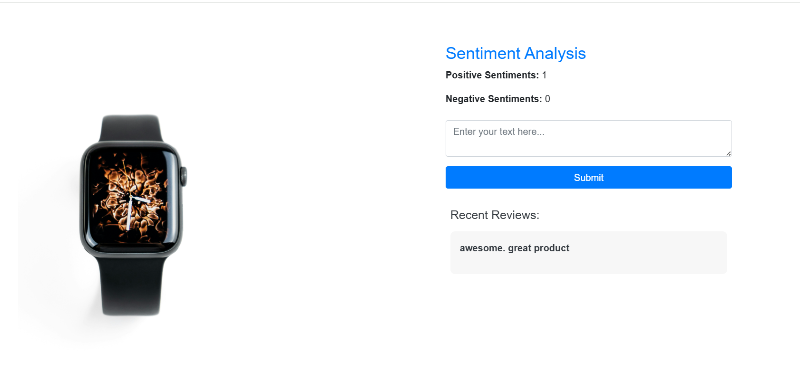

# Sentiment Analysis Using Machine Learning



This repository contains a sentiment analysis project that processes and classifies text data using machine learning techniques. The project includes data preprocessing, model training, and evaluation.

## Project Overview
This project aims to classify text sentiments as positive or negative. The dataset is preprocessed using text normalization techniques, tokenization, stopword removal, and feature extraction. The machine learning model is trained using balanced data to improve classification performance.

## Features
- Data Preprocessing (Cleaning, Tokenization, Stopword Removal, Lemmatization)
- Data Balancing using SMOTE (Synthetic Minority Over-sampling Technique)
- Model Training with Machine Learning Algorithms
- Model Evaluation using Accuracy, Precision, Recall, and F1-score
- Kaggle API Integration for Dataset Downloading
- Deployment-ready Code for Sentiment Analysis

## Technologies Used
- **Python** (pandas, numpy, re, string)
- **Scikit-learn** (machine learning models, metrics)
- **imblearn** (SMOTE for data balancing)
- **Kaggle API** (Dataset fetching)
- **NLTK** (Stopword Removal, Lemmatization)
- **Matplotlib** (Data Visualization)


## Project Structure
```
📂 sentiment-analysis
│-- 📂 artifacts/                  # Data files and extracted datasets
│-- 📂 static/model/               # Saved models and vocabulary
│-- 📂 scripts/                    # Code for training, preprocessing, and evaluation
│-- 📂 notebooks/                  # Jupyter Notebooks for analysis
│-- preprocess.py                   # Data preprocessing script
│-- train.py                         # Model training script
│-- evaluate.py                      # Model evaluation script
│-- requirements.txt                  # List of required dependencies
│-- README.md                         # Project documentation
```

